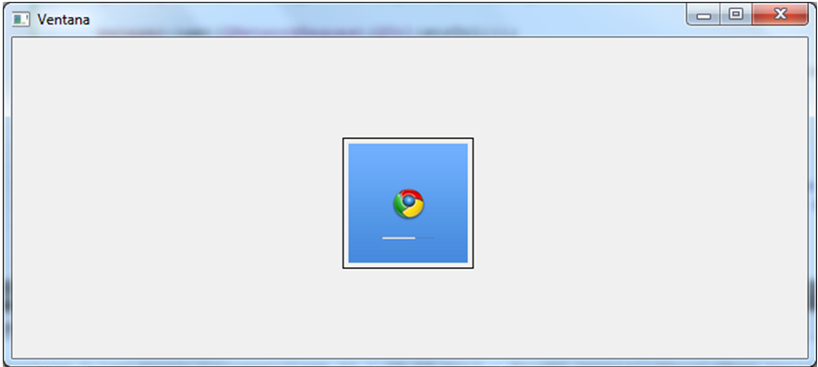

.. -*- coding: utf-8 -*-

.. _rcs_subversion:

Clase 11 - POO 2023
===================
(Fecha: 4 de mayo)

Array como parámetro en funciones
^^^^^^^^^^^^^^^^^^^^^^^^^^^^^^^^^

.. code-block:: c

	#include <iostream>
	using namespace std;

	void funcion( int miArray[] );
	// Le estamos pasando un puntero al primer elemento del array.

	int main()  {
	    int miA[ 5 ] = { 0, 1, 2, 3, 4 };

	    funcion( miA );

	    cout << miA[ 0 ] << miA[ 1 ] << miA[ 2 ] << miA[ 3 ] << miA[ 4 ];
	}

	void funcion( int miArray[] )  {
	    miArray[ 0 ] = 5;  // Las modificaciones quedarán.

	    miArray[ 3 ] = 5; 
	} 

Constructores con argumentos por defecto
^^^^^^^^^^^^^^^^^^^^^^^^^^^^^^^^^^^^^^^^

.. code-block:: c

	class ClaseA  {
	public:
	    ClaseA( int a = 10, int b = 20 ) : a( a ), b( b )  {  }
	
	    void verDatos( int &a, int &b )  {
	        a = this->a;
	        b = this->b;
	    }

	private:
	    int a, b;
	};

	int main( int argc, char ** argv )  {
	    ClaseA * objA = new ClaseA;

	    int a, b;
	    objA->verDatos( a, b );
	
	    std::cout << "a = " << a << " b = " << b << std::endl;

	    return 0;
	}

	// Probar con:	
	
	ClaseA( int c, int a = 10, int b = 20 ) : a( a ), b( b ), c( 0 )  {  }

	ClaseA( int a = 10, int b = 20, int c ) : a( a ), b( b ), c( 0 )  {  }

QTextEdit
=========

- Un QWidget que muestra texto plano o enriquecido
- Puede mostrar imágenes, listas y tablas
- La barra de desplazamiento es automática
- Interpreta tags HTML
- Seteamos texto con setPlainText()

Ejercicio 18
============

- Escribir la salida por consola de la siguiente aplicación:

.. code-block:: c

	#include <QApplication>
	#include <QDebug>

	int main( int argc, char** argv )  {
	    QApplication app( argc, argv );

	    int a = 10, b = 100, c = 30, d = 1, e = 54;
	    int m[ 10 ] = { 10, 9, 80, 7, 60, 5, 40, 3, 20, 1 };
	    int *p = &m[ 3 ], *q = &m[ 6 ];

	    ++q;
	    qDebug() << a + m[ d / c ] + b-- / *q + 10 + e--;

	    p = m;
	    qDebug() << e + *p + m[ 9 ]++;

	    return 0;
	}

Ejercicio 19
============
	
- Comenzar un proyecto vacío con QtCreator y diseñar un login de usuarios:
 
.. figure:: imagenes/login.png 

- Tendrá un tamaño de 250x120 píxeles y llevará por título "Login".
- El único usuario válido es: (DNI del alumno):(últimos 3 números del DNI)
- Ocultar con asteriscos la clave.
- Si el usuario y clave no es válido, sólo el campo de la clave se deberá limpiar.
- Al fallar la clave 3 veces, la aplicación se cierra. 
- Si el usuario es válido, entonces se oculta el login y se visualiza un nuevo QWidget como el que sigue:

- Utilizar una imagen del disco aproximadamente de 100x100 píxeles.
- Esta imagen se mostrará en el QWidget exactamente centrada.
- Dibujar además un cuadrado que envuelva la imagen (como muestra el ejemplo).
- La ventana puede tener cualquier tamaño pero llevará por título "Ventana".

Ejercicio 20
============

- Crear una aplicación que inicie con un login validando el usuario admin:123
- Luego de ingresar el usuario válido, mostrar un nuevo QWidget con las siguientes características:
	- Definida en la clase Editor
	- Contendrá un QTextEdit vacío, un QPushButton "Buscar" y un QLabel
	- El usuario podrá escribir cualquier texto en el QTextEdit
	- Al presionar "Buscar" se detectará automáticamente la cantidad de letras 'a' en el texto y colocará el resultado en el QLabel.
- Luego de dejar funcionando lo anterior, agregar lo siguiente:
	- Un QLineEdit y un QPushButton "Borrar"
	- En este QLineEdit el usuario puede colocar una palabra o frase
	- Al presionar Borrar se buscará en el texto y se eliminarán

Entrega Nro. 2 (para el 11 y/o 12 de mayo)
==========================================

- Es continuación de la entrega nro. 1
- Luego del login validando con la tabla de usuarios disponible en la API propia, mostrar una ventana.
- Si el usuario y/o clave es incorrecta, mostrar un mensaje con ``QMessageBox``
- Si el usuario falla 3 veces la clave, bloquear por 5 minutos.
- En la ventana que se muestra luego del login, colocar un QTextEdit mostrando la información sobre el tema exploratorio.
- Utilizar HTML en el mismo QTextEdit.
