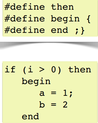

.. -*- coding: utf-8 -*-

.. _rcs_subversion:

Clase 12 - POO 2023
===================
(Fecha: 5 de mayo)

Registro en video de algunos temas de la clase de hoy
^^^^^^^^^^^^^^^^^^^^^^^^^^^^^^^^^^^^^^^^^^^^^^^^^^^^^

`Dibujar a mano - QByteArray - Preprocesador 2021 <https://www.youtube.com/watch?v=8Gu5_ejipus>`_

`Riesgos de publicar contraseñas en GitHub 2023 <https://youtu.be/bT9Wfg-IrGM>`_

`Preprocesador y guardían de inclusión múltiple 2023 <https://youtu.be/75RIKDem8NI>`_

:Videos recomendados:
	Ver `Tutorial Qt QVector <https://www.youtube.com/watch?v=Z9u2yDPh57U>`_ de `Videos tutoriales de Qt <https://www.youtube.com/playlist?list=PL54fdmMKYUJvn4dAvziRopztp47tBRNum>`_

	Ver `Tutorial Qt QDateTime <https://www.youtube.com/watch?v=bZmGhmKv5iE>`_ de `Videos tutoriales de Qt <https://www.youtube.com/playlist?list=PL54fdmMKYUJvn4dAvziRopztp47tBRNum>`_

	Ver `Tutorial Qt signals & slots <https://www.youtube.com/watch?v=IITGountoO4>`_ de `Videos tutoriales de Qt <https://www.youtube.com/playlist?list=PL54fdmMKYUJvn4dAvziRopztp47tBRNum>`_

El preprocesador
^^^^^^^^^^^^^^^^

-	Analiza el archivo fuente antes de la compilación real
-	Realiza las sustituciones de macros
-	Una macro es un patrón de sustitución formado por expresiones textuales
-	Procesa las directivas (``#include``, ``#define``, ``#ifndef``, ...)
-	Elimina los comentarios.

**Directivas #ifdef #endif #ifndef**

- Con ``#ifdef`` si la macro está definida, entonces hace lo siguiente hasta encontrar un ``#endif``
- ``#ifndef`` pregunta si no está definida

**Directiva #include**

- Inserta archivos
- Influye sobre el ámbito y los identificadores

.. code-block:: c

	#include <nombre de fichero cabecera>
	#include "nombre de fichero de cabecera"

**Directiva #define**

- Define macros para sustituir cada vez que se encuentre el identificador.

.. code-block:: c

	#define identificador <secuencia>
	
-	Si 'secuencia' no existe, el identificador será eliminado cada vez que aparezca
-	No es necesario añadir un punto y coma al final
-	Termina en el primer retorno de línea encontrado
-	Podríamos definir un nuevo lenguaje
 

**Ejercicio:**

- Nuevo proyecto Empty 
- Crear un .h vacío y definir una clase Persona con int edad y string nombre.
- En el archivo ``main.cpp`` incluir dos veces el archivo .h
- Tratar de resolver el problema sólo modificando el .h

Guardián de inclusión múltiple
^^^^^^^^^^^^^^^^^^^^^^^^^^^^^^

- Este problema se soluciona con el uso del **Guardián de inclusión múltiple**:

.. code-block:: c

	#ifndef PRINCIPAL_H
	#define PRINCIPAL_H

	// . . . 

	#endif // PRINCIPAL_H

Ejercicio 19
============
	
- Comenzar un proyecto vacío con QtCreator y diseñar un login de usuarios:
 
.. figure:: imagenes/login.png 

- Tendrá un tamaño de 250x120 píxeles y llevará por título "Login".
- El único usuario válido es: (DNI del alumno):(últimos 3 números del DNI)
- Ocultar con asteriscos la clave.
- Si el usuario y clave no es válido, sólo el campo de la clave se deberá limpiar.
- Al fallar la clave 3 veces, la aplicación se cierra. 
- Si el usuario es válido, entonces se oculta el login y se visualiza un nuevo QWidget como el que sigue:

.. figure:: imagenes/ventana.png

- Utilizar una imagen del disco aproximadamente de 100x100 píxeles.
- Esta imagen se mostrará en el QWidget exactamente centrada.
- Dibujar además un cuadrado que envuelva la imagen (como muestra el ejemplo).
- La ventana puede tener cualquier tamaño pero llevará por título "Ventana".

Ejercicio 20
============

- Crear una aplicación que inicie con un login validando el usuario admin:123
- Luego de ingresar el usuario válido, mostrar un nuevo QWidget con las siguientes características:
	- Definida en la clase Editor
	- Contendrá un QTextEdit vacío, un QPushButton "Buscar" y un QLabel
	- El usuario podrá escribir cualquier texto en el QTextEdit
	- Al presionar "Buscar" se detectará automáticamente la cantidad de letras 'a' en el texto y colocará el resultado en el QLabel.
- Luego de dejar funcionando lo anterior, agregar lo siguiente:
	- Un QLineEdit y un QPushButton "Borrar"
	- En este QLineEdit el usuario puede colocar una palabra o frase
	- Al presionar Borrar se buscará en el texto y se eliminarán

